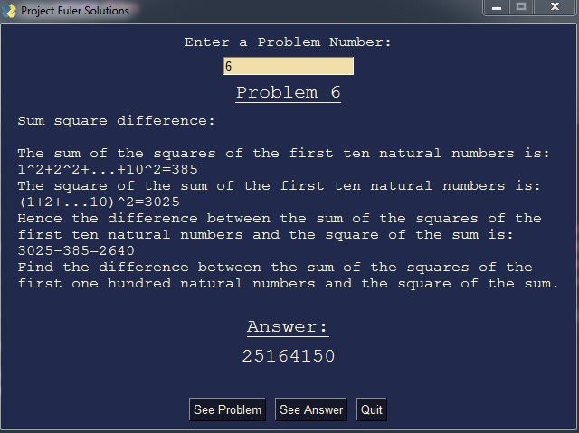

# PyProjectEuler

**ABSTRACT**:
These are my personal solutions to the Project Euler problems

[Project Euler](https://projecteuler.net/)
  
****************************************************************

## Problems

| Problem        | Status     | Execution Time (s) |
|--------------|-----------|------------|
| [Problem 1](https://github.com/spicyNoodles15/PyProjectEuler/blob/main/solutions/problem_1.py) | Solved      | .001s    |
| [Problem 2](https://github.com/spicyNoodles15/PyProjectEuler/blob/main/solutions/problem_2.py) | Solved      | .001s    |
| [Problem 3](https://github.com/spicyNoodles15/PyProjectEuler/blob/main/solutions/problem_3.py) | Solved      | .096s    |
| [Problem 4](https://github.com/spicyNoodles15/PyProjectEuler/blob/main/solutions/problem_4.py) | Solved      | .286s   |
| [Problem 5](https://github.com/spicyNoodles15/PyProjectEuler/blob/main/solutions/problem_5.py) | Solved      | 93.892s  |
| [Problem 6](https://github.com/spicyNoodles15/PyProjectEuler/blob/main/solutions/problem_6.py) | Solved      | .001s    |
| [Problem 7](https://github.com/spicyNoodles15/PyProjectEuler/blob/main/solutions/problem_7.py) | Solved      | .143s    |
| [Problem 8](https://github.com/spicyNoodles15/PyProjectEuler/blob/main/solutions/problem_8.py) | Solved      | .552s    |
| Problem 9 | Unsolved    | ??       |
| [Problem 10](https://github.com/spicyNoodles15/PyProjectEuler/blob/main/solutions/problem_10.py) | Solved    | 6.702s   |
| Problem 11 | Unsolved    | ??       |
| Problem 12 | Unsolved    | ??       |
| Problem 13 | Unsolved    | ??       |
| Problem 14 | Unsolved    | ??       |
| Problem 15 | Unsolved    | ??       |
| Problem 16 | Unsolved    | ??       |
| Problem 17 | Unsolved    | ??       |
| Problem 18 | Unsolved    | ??       |
| Problem 19 | Unsolved    | ??       |
| Problem 20 | Unsolved    | ??       |
| Problem 21 | Unsolved    | ??       |
| Problem 22 | Unsolved    | ??       |
| Problem 23 | Unsolved    | ??       |
| Problem 24 | Unsolved    | ??       |
| [Problem 25](https://github.com/spicyNoodles15/PyProjectEuler/blob/main/solutions/problem_25.py) | Solved    | 0.033s   |
|--------------|-----------|------------|

## GUI

Added a simple gui (PySimpleGUI) to display each problem and answer if I've solved it using Python

