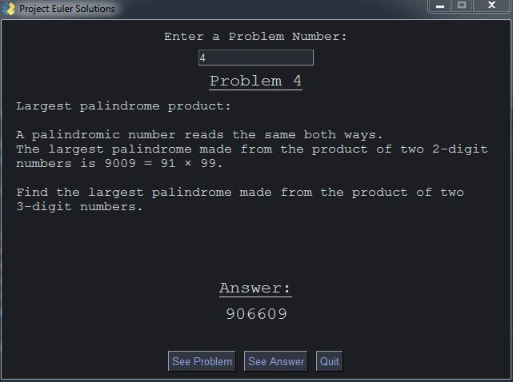

# PyProjectEuler

**ABSTRACT**:
These are my personal solutions to the Project Euler problems

[Project Euler Website](https://projecteuler.net/)

"Project Euler exists to encourage, challenge, and develop the skills and enjoyment of anyone with an interest in the fascinating world of mathematics."

****************************************************************

## Problems

| Problem        | Solution     | Status     | Execution Time (s) |
|--------------|-----------|-----------|------------|
| [Problem 1](https://projecteuler.net/problem=1) | [Solution](https://github.com/spicyNoodles15/PyProjectEuler/blob/main/solutions/problem_1.py) | Solved      | .001s    |
| [Problem 2](https://projecteuler.net/problem=2) | [Solution](https://github.com/spicyNoodles15/PyProjectEuler/blob/main/solutions/problem_2.py) | Solved      | .001s    |
| [Problem 3](https://projecteuler.net/problem=3) | [Solution](https://github.com/spicyNoodles15/PyProjectEuler/blob/main/solutions/problem_3.py) | Solved      | .096s    |
| [Problem 4](https://projecteuler.net/problem=4) | [Solution](https://github.com/spicyNoodles15/PyProjectEuler/blob/main/solutions/problem_4.py) | Solved      | .286s   |
| [Problem 5](https://projecteuler.net/problem=5) | [Solution](https://github.com/spicyNoodles15/PyProjectEuler/blob/main/solutions/problem_5.py) | Solved      | 93.892s  |
| [Problem 6](https://projecteuler.net/problem=6) | [Solution](https://github.com/spicyNoodles15/PyProjectEuler/blob/main/solutions/problem_6.py) | Solved      | .001s    |
| [Problem 7](https://projecteuler.net/problem=7) | [Solution](https://github.com/spicyNoodles15/PyProjectEuler/blob/main/solutions/problem_7.py) | Solved      | .143s    |
| [Problem 8](https://projecteuler.net/problem=8) | [Solution](https://github.com/spicyNoodles15/PyProjectEuler/blob/main/solutions/problem_8.py) | Solved      | .552s    |
| [Problem 9](https://projecteuler.net/problem=9) | [Solution](https://github.com/spicyNoodles15/PyProjectEuler/blob/main/solutions/problem_9.py) | Solved      | .079s     |
| [Problem 10](https://projecteuler.net/problem=10) | [Solution](https://github.com/spicyNoodles15/PyProjectEuler/blob/main/solutions/problem_10.py) | Solved    | 6.702s   |
| [Problem 11](https://projecteuler.net/problem=11) | Problem 11 | Unsolved    | ??       |
| [Problem 12](https://projecteuler.net/problem=12) | Problem 12 | Unsolved    | ??       |
| [Problem 13](https://projecteuler.net/problem=13) | Problem 13 | Unsolved    | ??       |
| [Problem 14](https://projecteuler.net/problem=14) | Problem 14 | Unsolved    | ??       |
| [Problem 15](https://projecteuler.net/problem=15) | Problem 15 | Unsolved    | ??       |
| [Problem 16](https://projecteuler.net/problem=16) | Problem 16 | Unsolved    | ??       |
| [Problem 17](https://projecteuler.net/problem=17) | Problem 17 | Unsolved    | ??       |
| [Problem 18](https://projecteuler.net/problem=18) | Problem 18 | Unsolved    | ??       |
| [Problem 19](https://projecteuler.net/problem=19) | Problem 19 | Unsolved    | ??       |
| [Problem 20](https://projecteuler.net/problem=20) | Problem 20 | Unsolved    | ??       |
| [Problem 21](https://projecteuler.net/problem=21) | Problem 21 | Unsolved    | ??       |
| [Problem 22](https://projecteuler.net/problem=22) | Problem 22 | Unsolved    | ??       |
| [Problem 23](https://projecteuler.net/problem=23) | Problem 23 | Unsolved    | ??       |
| [Problem 24](https://projecteuler.net/problem=24) | Problem 24 | Unsolved    | ??       |
| [Problem 25](https://projecteuler.net/problem=25) | [Solution](https://github.com/spicyNoodles15/PyProjectEuler/blob/main/solutions/problem_25.py) | Solved    | 0.033s   |
|--------------|-----------|-----------|------------|

## GUI

Added a simple gui (PySimpleGUI) to display each problem and answer if I've solved it using Python

